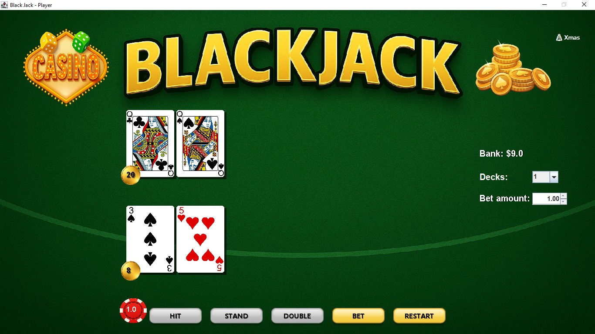

# Java Blackjack GUI Game

**Gameplay Preview:**


This project demonstrates advanced Object-Oriented Programming (OOP) concepts, event-driven programming, and custom GUI design using Java Swing and AWT.

## Key Features

* **Interactive User Interface**: Built with Java Swing, featuring custom gold-styled buttons and real-time display updates.
* **Animated Card Dealing**: Implements a synchronized queue system for smooth card movement animations from the deck to the players.
* **Dynamic Betting System**: Includes a virtual balance management system with payout animations and a JSpinner for precise bet selection.
* **Themed Experience**: Supports a theme toggle between "Classic" and "Xmas" modes, updating backgrounds and card assets dynamically.
* **Dealer AI**: Automates dealer actions based on standard casino rules, requiring the dealer to draw until reaching a minimum score of 17.
* **Ace Logic**: Automatically adjusts Ace values between 1 and 11 to prevent the player or dealer from busting.

## Project Architecture

The application is structured into several core classes to maintain clean code and separation of concerns:

* **BlackJackGUI.java**: The main engine handling the game loop, user interactions, and visual animations.
* **Player.java / Dealer.java**: Implements inheritance, where the Dealer inherits basic hand logic and extends it with automated rules.
* **Card.java / Deck.java**: Manages individual card properties, image pathing, and multi-deck shuffling logic.
* **Hand.java**: A composition class within Player responsible for score calculation and hand state management.

## Setup for Eclipse Users

This project was developed and tested using the **Eclipse IDE**.

1. **Clone the repository**:
   `git clone https://github.com/jazgonzalez/java-blackjack-game.git`
2. **Import Project**:
   * Open Eclipse and navigate to `File > Import...`.
   * Choose `General > Existing Projects into Workspace`.
   * Select the root folder of this project (it contains the `.project` and `.classpath` files).
3. **Run**:
   * Locate `BlackJackGUI.java` in the `src/finalProject/` directory.
   * Right-click and select `Run As > Java Application`.

### Manual Execution (Terminal)
```bash
# Compile all source files
javac src/finalProject/*.java

# Run the GUI application
java -cp src finalProject.BlackJackGUI
